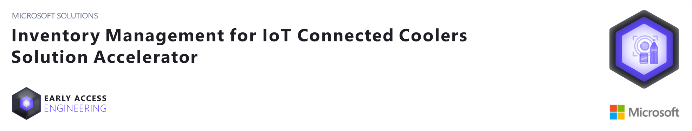
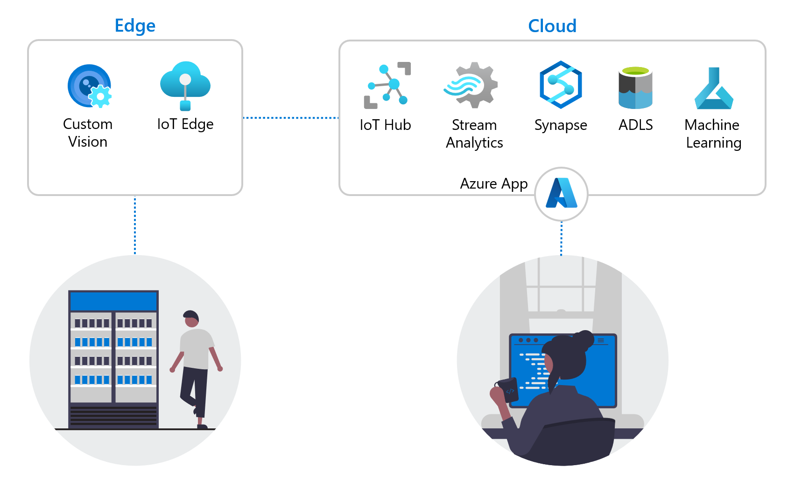
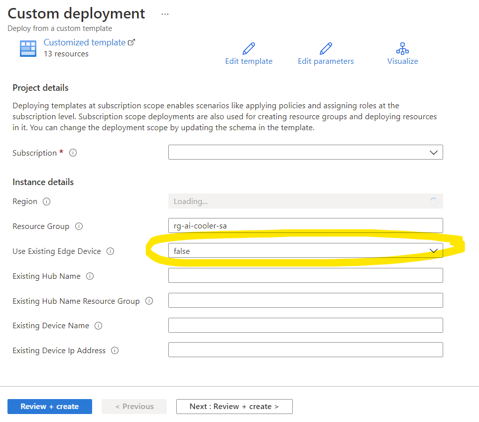
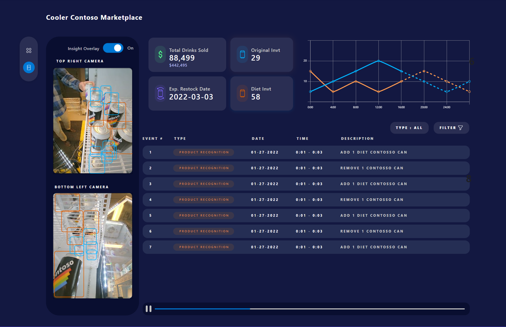

## About This Repository ##
Many beverage companies spend a great deal of time, money, and other resources checking inventory levels in stand-alone coolers.
These coolers can be located at retail stores, cafeterias, or any other place an organization wants to provide ready access to cold beverages.
Beverage companies must often send a truck to each location without knowing if more stock is required.
To unknowingly let a cooler sit empty damages the bottom line and causes a poor experience for thirsty end-customers.
The challenge of efficiently maintaining cooler inventory and promoting a positive customer experience can be solved with IoT sensors, machine learning algorithms, and other public cloud infrastructure. 

This solution accelerator shows you how to develop an inventory management solution, IoT and AI powered solution that tracks inventory at remote locations, uploads this data to Azure, and
applies machine learning based forecasting models to predict restocking needs. This data on future needs can be use in a variety of ways,
not the least of which is scheduling delivery trucks (or other resources) more efficiently. 

This repo is organized into two parts, a simulated solution and a physical, or proof of concept (POC), solution.
- **Simulated Solution** -- You'll find everything you need set up a demonstration highlighting how IoT Edge technology can be combined with other cloud services 
to track inventory remotely and deliver real time alerts to improve business efficiency.
- **POC Solution** -- You'll find detailed instructions on how to set up hardware components and configure cloud services 
to deliver a similar inventory management solution for a real-world scenario. 

Continue reading to learn about the different solution components and how to deploy the demo. 
We recommend you become familiar with the simulation before learning about the [POC solution](./documents/getting_started_POC.md).

## Solution Overview

### IoT Edge
IoT Edge devices are configured to observe beverage coolers and infer when customers remove (or return) beverage containers. 
This and other inventory data, such a product type removed, are relayed to the cloud on a regular schedule, e.g. hourly. 

### Azure Synapse
IoT messages are relayed to the cloud and stored in Common Data Model format to facilitate analysis by Azure Synapse and other cloud services, including Azure Machine Learning. 

### App Service
A web application provides users with current inventory information and predicted restocking needs after accessing this data through Azure Synapse.

### Architectural Overview

## Getting Started: Simulated Solution
The first part of this accelerator shows how to deploy a simulated solution for tracking inventory in a beverage cooler. 
 
### Prerequisites 
1. Access to an Azure subscription with required permissions and sufficient resource quotas. 
1. A basic understanding of [IoT and Edge Computing](https://azure.microsoft.com/en-us/services/iot-edge/#iotedge-overview)

### Deploy Simulation
The information and templates in the [deployment folder](./deployment) will be used to deploy the resources needed for this simulation to your Azure subscription. This can be done manually using the scripts provided or the "Deploy to Azure" link below. 
 
The simulation will highlight the following solution components.

1. Remote inventory monitoring -- A video feed showing customer activity at a beverage cooler and the results of the object detection model. 
1. Display inventory status -- A dashboard showing inventory location, status and historical metrics. 
1. Predict restocking needs  -- A prediction of future inventory levels.   

Before you deploy the resources, be sure the following resource providers are registered on your subscription. 
If you are using an existing subscription, some may already be registered. 
- Microsoft.Cognitiveservices 
- Microsoft.Compute
- Microsoft.Containerregistry
- Microsoft.Iot
- Microsoft.Media
- Microsoft.Sql
- Microsoft.Storage
- Microsoft.Synapse 

    **Reminder:** Not all services are available in all regions. 
    Check here to find out the [current availability](https://azure.microsoft.com/en-us/global-infrastructure/services/?products=all) of the services needed for this deployement. 
    Here is a partial list of regions which will support this deployment. 
    - East US
    - North Europe
    - Southeast Asia
    - West US 2 

        

Use this link to deploy the simulation into your Azure Subscription. 

You will be prompted to fill out several parameters 
1. Subscription -- The subscription in which you would like to deploy the simulation 
1. Azure region -- Select a region
1. Resource group -- This will be pre-populated
1. Use Existing Edge Device  
    - For simulated solution: set to **false**  
        - No other parameters are needed here for the simulated solution 
    - You will set this value to **true** and provide the additional values from your edge device when building your [POC solution](./documents/getting_started_POC.md)

After these values are provided, click "Review + create" to deploy the resources. 
The deployment will take 20-30 minutes to complete.  

### Verify Deployment

Verify that your deployment was successful by checking the status in the Azure portal and by viewing the sample web application.  
- Follow these steps to [view the web app](./documents/findWebApp_README.md) and cooler event videos. 

## POC Solution  
After observing the simulation you may want to build and deploy your own real-world inventory management solution. 
Follow this link to learn more about the [POC solution](./documents/getting_started_POC.md). 

The POC solution includes several changes which translate the simulated solution into a working physical implementation, including 

1. Beverage cooler inventory tracking
    - Continuous monitoring and object detection using a live IoT edge device 
1. Online synthesis of inventory data
    - The IoT Hub will route data from the edge device to an Azure Synapse data warehouse where multiple tables will be updated. From here a web app is used to visualize the data.
1. Predict restocking needs and recommend restocking schedule 
    - The Azure Synapse data warehouse data will be leveraged by a machine learning model to predict when each cooler will 
need restocking. You can also provide alerts the beverage company recommended restocking dates. This part of the solution leverages the ML model described in the [Many Models Solution Accelerator](https://github.com/microsoft/solution-accelerator-many-models)

**REMINDER:** The physical solution described here was developed using locally available resources and is based on a unique retail scenario.
This solution will almost certainly require modifications before it can be deployed in a way that fits your business scenario. 

## Folders
- analytics
- cameras
- deployment
- documents
- doorSensor
- iotEdge
- pipelines

## License

Copyright (c) Microsoft Corporation.

MIT License

Permission is hereby granted, free of charge, to any person obtaining a copy
of this software and associated documentation files (the "Software"), to deal
in the Software without restriction, including without limitation the rights
to use, copy, modify, merge, publish, distribute, sublicense, and/or sell
copies of the Software, and to permit persons to whom the Software is
furnished to do so, subject to the following conditions:

The above copyright notice and this permission notice shall be included in all
copies or substantial portions of the Software.

THE SOFTWARE IS PROVIDED "AS IS", WITHOUT WARRANTY OF ANY KIND, EXPRESS OR
IMPLIED, INCLUDING BUT NOT LIMITED TO THE WARRANTIES OF MERCHANTABILITY,
FITNESS FOR A PARTICULAR PURPOSE AND NONINFRINGEMENT. IN NO EVENT SHALL THE
AUTHORS OR COPYRIGHT HOLDERS BE LIABLE FOR ANY CLAIM, DAMAGES OR OTHER
LIABILITY, WHETHER IN AN ACTION OF CONTRACT, TORT OR OTHERWISE, ARISING FROM,
OUT OF OR IN CONNECTION WITH THE SOFTWARE OR THE USE OR OTHER DEALINGS IN THE
SOFTWARE

## Note about Libraries with MPL-1.1, MPL-2.0 and LGPL-2.1 Licenses
  
The following libraries are not **explicitly included** in this repository, but users who use this Solution Accelerator may need to install them locally and in containers to fully utilize this Solution Accelerator. However, the actual binaries and files associated with the libraries **are not included** as part of this repository, but they are available for installation via the PyPI library using the pip installation tool.  
  
Libraries: pycairo, pygobject, axe-core, certifi

## Data Collection
The software contained in this rep may collect information about you and your use of the software and send it to Microsoft. 
Microsoft may use this information to provide services and improve our products and services. 
You may turn off the telemetry as described in the repository. 
There are also some features in the software that may enable you and Microsoft to collect data from users of your applications. 
If you use these features, you must comply with applicable law, 
including providing appropriate notices to users of your applications together with a copy of Microsoft’s [privacy statement](https://go.microsoft.com/fwlink/?LinkID=824704). 
You can learn more about data collection and use in the help documentation and our privacy statement. 
Your use of the software operates as your consent to these practices.

To disable the telemetry in this solution, remove the following sections from the [start.deploy.json](./deployment/arm-templates/start.deploy.json) before deploying resources to Azure. 

- **Method 1**

           {
            "type": "Microsoft.Resources/resourceGroups",
            "apiVersion": "2020-06-01",
            "name": "[parameters('resourceGroup')]",
            "comments": "The primary resource group that will be used for new resources.",
            "location": "[deployment().location]",
            "properties": {},
            "tags": "[variables('resourceTags')]"
            },
            
            {
            "condition": "[not(parameters('useExistingEdgeDevice'))]",
            "type": "Microsoft.Resources/resourceGroups",
            "apiVersion": "2020-06-01",
            "name": "[variables('VMResourceGroup')]",
            "comments": "The primary resource group that will be used for new resources.",
            "location": "[deployment().location]",
            "properties": {},
            "tags": "[variables('resourceTags')]"
            }

- **Method 2**

            {
            "type": "Microsoft.Resources/deployments",
            "apiVersion": "2020-06-01",
            "name": "pid-158c9b70-6767-44a6-b677-8ac4ceb0502f",
            "location": "[deployment().location]",
            "properties": {
            "mode": "Incremental",
            "template": {
                "$schema": "https://schema.management.azure.com/schemas/2015-01-01/deploymentTemplate.json#",
                "contentVersion": "1.0.0.0",
                "resources": []
            }
            }
            }

## Trademarks
This project may contain trademarks or logos for projects, products, or services. 
Authorized use of Microsoft trademarks or logos is subject to and must follow [Microsoft’s Trademark & Brand Guidelines](https://www.microsoft.com/en-us/legal/intellectualproperty/trademarks). 
Use of Microsoft trademarks or logos in modified versions of this project must not cause confusion or imply Microsoft sponsorship. 
Any use of third-party trademarks or logos are subject to those third-party’s policies.

