# Deploying Analytic Resources for the POC Solution 

This page provides step-by-step instructions for setting up the resources needed for the analytic portion of the POC solution.
You will also import sample data, to replicate the data that would be ingested into cloud-based storage from actual coolers, via IoT messaging. 

**Note: This POC solution is intended to show you how to setup all the cloud resources needed to deploy a real-world, physical solution.
Your actual solution will differ from this solution. 
Use these instructions as a guide to building out a physical POC that meets the needs of your business scenario.**

## Prerequisites
1. Complete Steps 1 and 2 from POC "Getting Started" page. The automated install in Step 2 will also stage the necessary example data files in a _rawdata_ container in the Synapse Azure Data Lake Service (ADLS) account.
1. An Azure subscription with sufficient permissions and quotas.
    

## Step 1.)  Open You Synapse Workspace

#### In the Azure Portal, navigate to the solution resource group and click into your Synapse workspace

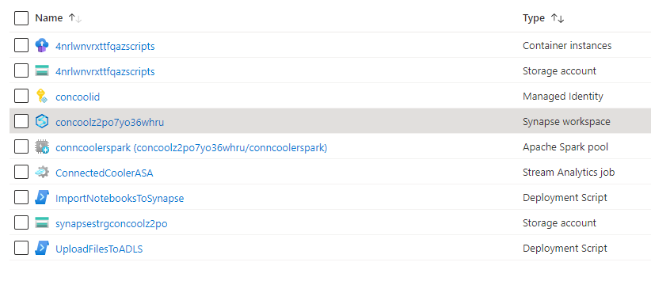

#### When you see the tile for Synapse Studio, click the _Open_ link

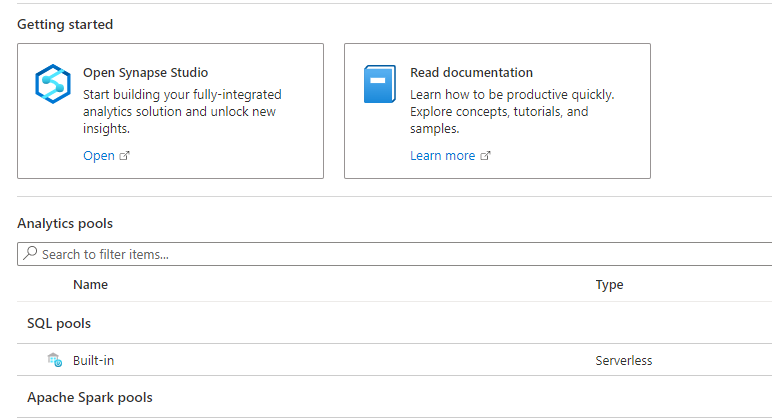

## Step 2.) Add Lake Database

#### Click on the _data_ icon in the left vertical toolbar

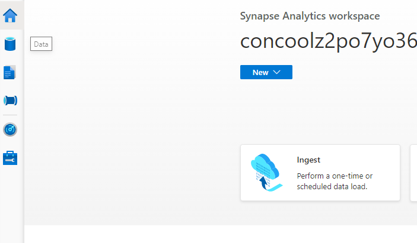

#### Choose the + icon to add a new resource

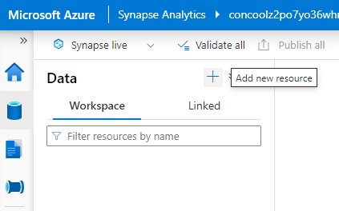

#### Choose to add a Lake Database

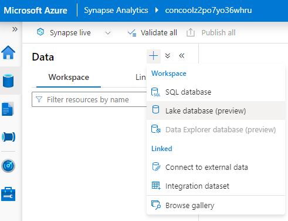

#### If you agree, choose OK to acknowledge understanding of the Preview feature

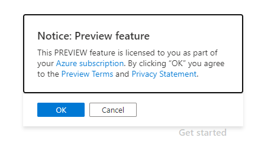

#### On the right hand side of the screen, you should see a dialog as below, rename the database 'ContosoCoolerData' or something similar

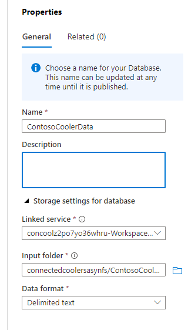

## Step 3.) Add Jupyter Notebooks

#### Click the Develop icon, then click the + icon and choose the Import option to import a new notebook from the solution

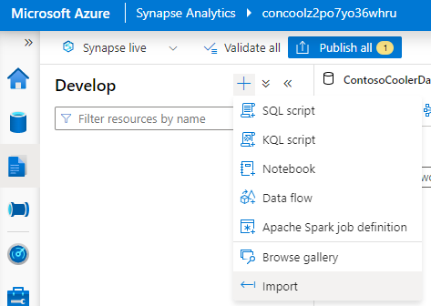

#### Navigate to the {Add Path}/notebooks directory and import the following notebooks.

**Notebooks**|
---------|
 load_data |
 demand_forecasting |
 inventory_functions |
 iot_ingestion |
-------

#### Click on the Publish all button and publish all of your changes

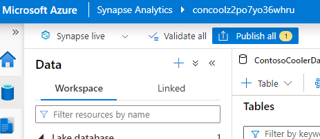

## 4.0 Load Data

#### Open the load_data notebook and, in the first cell, fill in the following variables

``` python
data_lake_account_name
synapse_workspace_name
database_name
```

You can find the first two values on the "Essentials" tab of your Synapse workspace. 
For `data_lake_account_name`, use the lowest level subdomain of the Primary ADLS Gen2 account URL (not the whole URL). 
This is the subdomain highlighted below in blue.
The `database_name` is simply the name of the database you created with your Synapse workspace.  

#### Where to find the value for `data_lake_account_name`

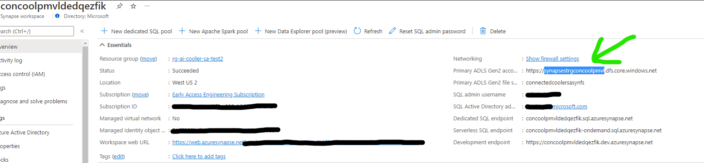

#### Once configured, click on the Run all button to create and load the data tables

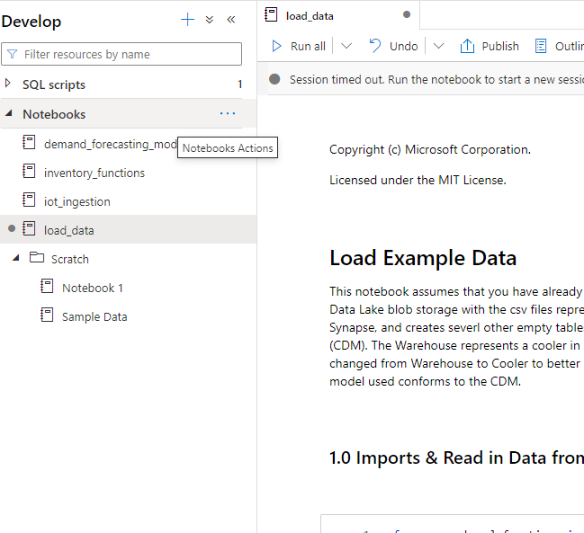

#### This completes the manual steps for deploying the analytic resources for the POC solution.