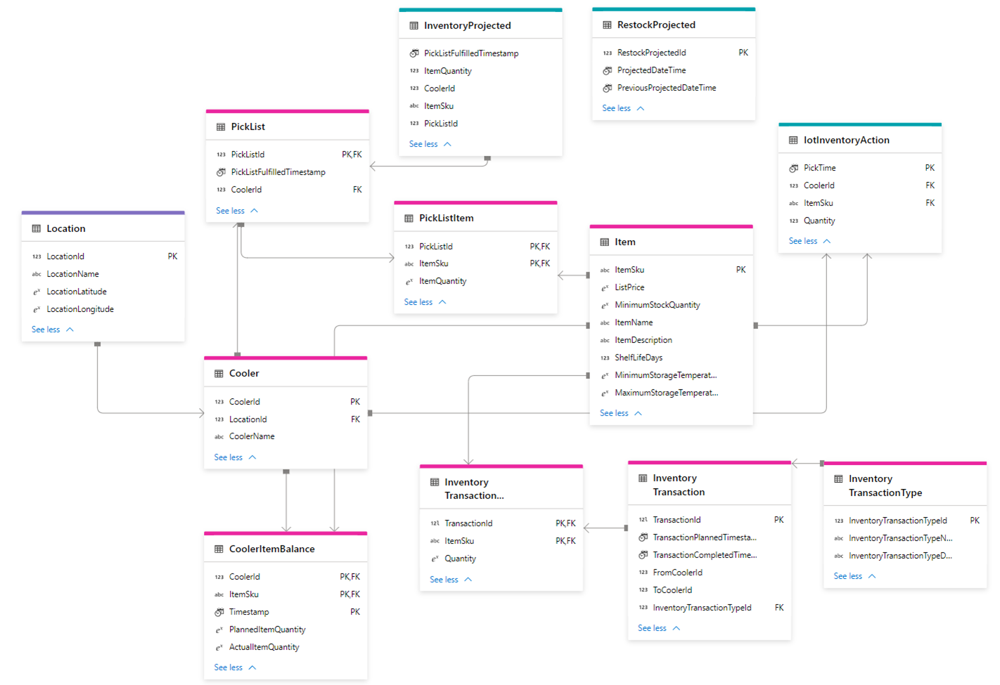
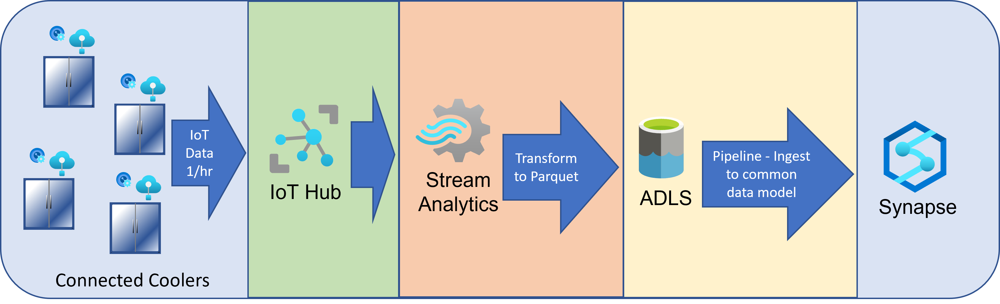

# Analyzing Inventory Data for IoT Connected Coolers 

## Introduction 

Data captured by the edge devices will be ingested into a data model based on the [Common Data Model](https://docs.microsoft.com/en-us/common-data-model/) for Retail. 
This will enable easier integration with existing services that provide a variety of tools for managing a retail business. 
In our example, data is uploaded hourly from the cooler. 
Over time, this data can be used to trail the AI models needed to track inventory and predict demand. 
This solution shows how this can be accomplished across many coolers and product SKUs. 
The predictions from the model are then used to intelligently determine a predicted restocking date for each cooler.

The analytics portion of this accelerator uses the following resources.
* Synapse
* Azure Machine Learning
* Azure Stream Analytics

We recommend you read this information about [Synapse Database Templates](https://docs.microsoft.com/en-us/azure/synapse-analytics/database-designer/concepts-database-templates) before deploying any services. 
However, you may preview resource deployment for this part of the solution by visiting the [deploy analytic resources](./deploy_analytic_resources.md) page.

**Reminder:** As you consider your own solution, think about where is the best source for this historical data.
If it is not available right away, you may need to collect enough data to train the AI/ML models before completing the POC. 

## Common Data Model and Data Relationships

The image below shows a portion of the data model for this accelerator. 
The CDM tables selected relate to inventory, as our project focuses on inventory management. 
The base entity model for inventory is based on a warehouse scenario. 
In a retail environment, this could represent a stock room or other inventory storage area, for our purposes it represents a cooler. 
There other CDM tables available, e.g. sales, order fulfillment, etc., depending on your business needs. 
We chose to track inventory at the cooler level because beverage manufacturers are often responsible for restocking retail coolers and 
do not have access to point-of-sale transaction information. 

We chose to leave the CDM table names unchanged from the Synapse Database Templates to make their original relationships more clear. 

In your own POC, you may wish to change the table name to better reflect your scenario. 
 

The diagram below shows the standard CDM entities chosen with red lines, and the custom tables specific to the solution in green. 
- For simplification, the solution design is using a small subset of the available columns within the template. 
- You can explore the data models using Synapse database templates, follow this link for [more information](https://docs.microsoft.com/en-us/azure/synapse-analytics/database-designer/concepts-database-templates).

## Ingestion of data from the connected coolers

Connected coolers are equipped with an IoT Edge device that sends cooler data on a regular cadence, e.g. hourly, to the Azure IoT Hub service.  
This data is then transferred and transformed by Azure Streaming Analytics, so it matches the desired schema in Synapse. 
Further processing can be accomplished by setting up a scheudled pipeline within Synapse to update the inventory data model with related metrics. 
Please see the iot_ingestion and inventory_functions notebooks provided.
These notebooks will update the inventory PickList, PickListItem tables to capture the timeseries - item removal data, and then update the CoolerItemBalance table with current item totals. 
The inventory_functions notebook calculates the projected restock date, using  the latest model data, and updates the RestockProjected table.

IoT Ingestion Flow
1. IoT Connected Cooler -> IoT Hub - once per hour per cooler
   - Timestamp / Cooler ID / SKU / Quantity
1. Azure Stream Analytics Job -> IotInventoryAction table
1. On a schedule,  items from IotInventoryAction are used to create PickList and PickListItem entries
1. On a schedule, items from PickList and PickListItems are used to update the cooler quantity on hand for each item in each cooler

## Deploying Analytic Resources Understanding the data and models

Now that you are familiar with the Common Data Model  and 
how it can be used in conjunction with other services to support an inventory management solution,
it is time to deploy the needed resources. 

Visit this page to for detailed instructions on how to [deploy analytic resources](./deploy_analytic_resources.md)

## Training and Deploying Machine Learning Models for Inventory Forecasting

One of the primary advantages of compiling granular data, e.g. hourly, is the ability to produce previously unavailable insights. 
For example, Machine Learning models can use this historical data to predict sales into the future. 
With consistent retraining, the models could accurately  forecast product level inventory in each cooler
The models could then deliver valuable insights, such as recommending a restocking date, that improve operational efficiency. 
These goals can be accomplished using the capabilities of Azure Machine Learning, as demonstrated in the Many Models Solution Accelerator. 

In the next section we describe how to modify the Many Models Accelerator to work with IoT connected coolers. 

Follow the instructions in the [model deployment instructions](./deploy_prediction_model.md) to: 

1. Setup the Many Models Solution Accelerator to deploy the necessary Azure Machine Learning (AML) environment to Azure, and to configure your development environment
1. Prepare your IoT Connected Cooler data for generating predictive models
1. Setup an AML pipeline and experiment to train models representing movement of specific product from specific coolers.
1. Run the training pipeline to produce the models
1. Run the inferencing pipeline to test the models against known data
1. Run a prediction pipeline to produce predictions of demand for each cooler and inventory item which can be loaded back into the InventoryProjected table
1. Predictions are generated from the winning model and imported into the InventoryProjected table
1. The predict_restock notebook can be run on a cadence in a Synapse Pipeline to predict when each cooler will require restocking based on the InventoryProjected information

To start building the predictive model, follow the instructions the  [demand_prediction_model](./deploy_prediction_model.md) page. 
