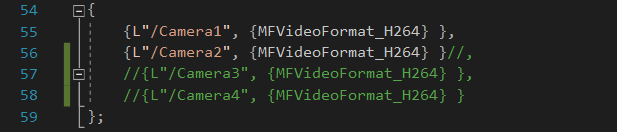
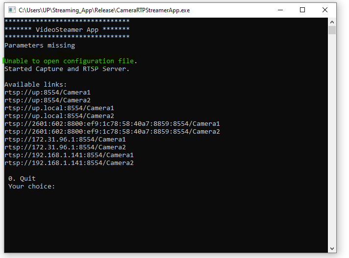

# Camera RTSP Passthrough Using a Sample Console Application

## Introduction
Suppose in a workflow, you have an application that leverages an RTSP video feed. When moving the workflow to run on an EFLOW VM, 
you may have problems accessing the video feed(s) since the EFLOW VM is isolated from the USB/IP camera(s) attached to the Windows host.

Follow these steps to configure an application running on an Azure IoT EFLOW VM to access  can access video feeds and cameras attached to the Windows host.

This sample application provided demonstrates how to passthrough a USB/IP camera RTSP stream to the EFLOW VM using Windows Media Foundation.
This repo was initially forked from the [Network Video Streamer repo](https://github.com/microsoft/Windows-Camera/tree/release/NetworkVideoStreamer_1_0).

## Scenario

You have a Linux application running on the EFLOW VM (the **client**) that requires an RTSP video feed. The video camera stream(s) are not available to the application.  
because they are attached to the Windows host (the **Server**) using Windows drivers.

To solve this challenge, we can we can create an RTSP server. Then, connect both the client and the cameras the Hyper-V virtual switch,
so the RTSP stream can be routed to the application. 

The following diagram shows the architecture described:
```
     Client (EFLOW VM)                                                   Server (Windows Host)          
+------------------------+                                            +------------------------+
|      RTSP Client       | ................ (network) ................|  Camera to RTSP server |
+------------------------+                                            +------------------------+
                                                                                  | USB/Bluetooth/IP
                                                                                  |
                                                                          +---------------+
                                                                          |    Camera     |
                                                                          +---------------+
```


## Setup and Run Sample App

This part describes how to develop the Windows console application in the development VM. You can follow the [Build and run a C++ console app project](https://docs.microsoft.com/cpp/build/vscpp-step-2-build) guide.

1. Open the Windows application sample - Use Visual Studio running as Admin.
     - Network Media Streamer: `WinUSBtoRTSP\NetworkMediaStreamer.sln`

2. Configure the app to accept the appropriate number of camera feeds.
     - The app can handle 1, 2, 3, or 4 camera streams. 
     - The default number of camera streams is 2. 
     - See lines 55-56, and 128-131 to configure the desired number of cameras



2. Setup 'CameraStreamerApp' as the startup project

3. On the top pane, set build to 'Release' and select the 'x64' architecture, and build the project.

4. The output path for the .exe package can be found in the below location.
     - Network Media Streamer: `WinUSBtoRTSP\x64\Release\CameraRTSPStreamer.exe`
     - **NOTE:** If you have multiple edge devices, you may choose to build the project remotely and then copy the contents of the Release folder to each edge device.

5. Run the 'CameraRTSPStreamer.exe' as an Administrator
 
> **Note:** If you are using RTSP, make sure a local certificate is installed 

6. Review camera properties 

     The sample app will present an interactive screen where that will list the cameras available and their RTSP Links.  


   


**Note:** Early versions of this app included a configuration file.
This file is no longer needed, though you may still receive a message that tells you this file can't be found.
You can ignore this error. 