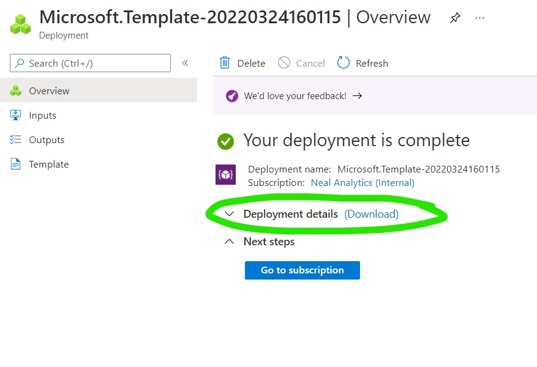
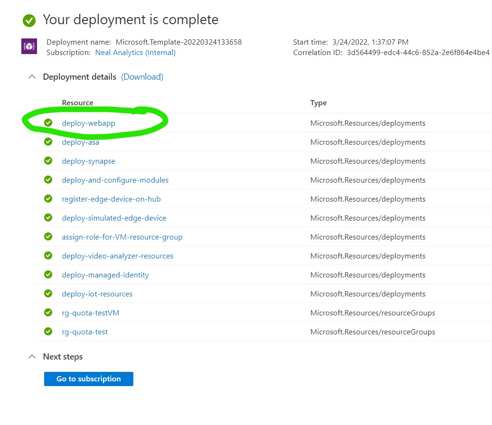
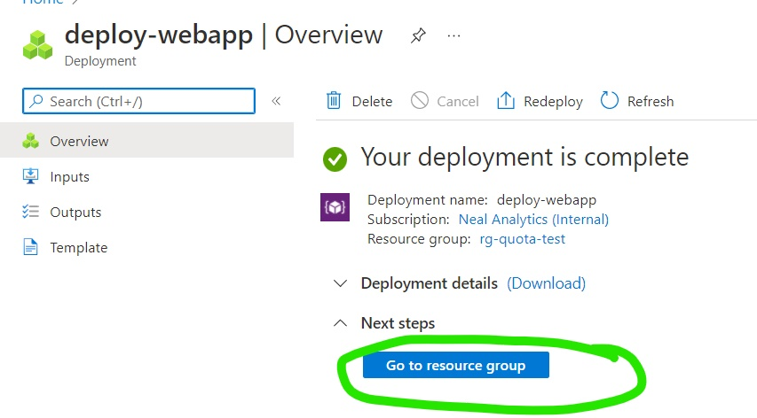
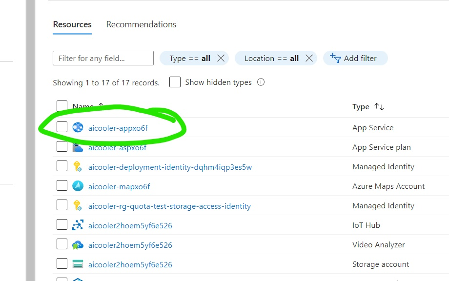
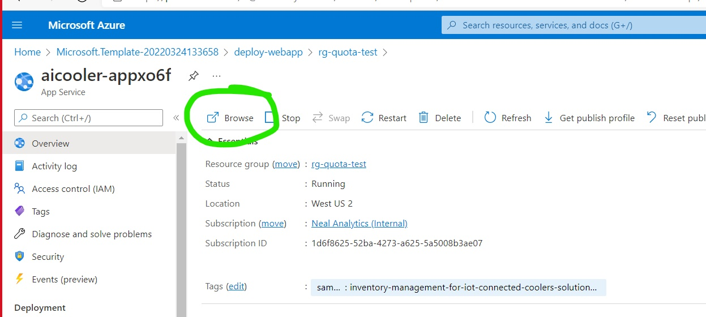
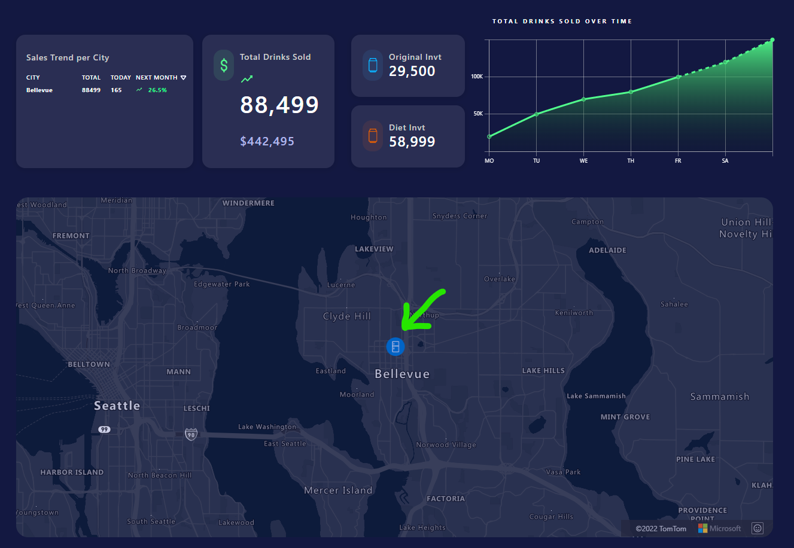

# Viewing the Web Application

This file describes how to navigate to the resource group for the web app and see the web app running, after launching a browser window. 

**Step 1.)**  

After your deployment completes, open the "Deployment details" dropdown.  

  

**Step 2.)**  

Click on the "deploy-webapp" link to see more information about this deployment.  

**Step 3.)**  

Click on "Go to resource group" to view the web app resources.  

  

**Step 4.)**

Click on the "App Service" resource, which will have a label similar to "ai-cooler-xxxx", to see the resource details. 

  

**Step 5.)**  

Click on "Browse", in the top menu, to launch a browser window.  

  

**Step 6.)**

You should now see the web app running in your browser. 
You will see inventory summary info near the top and a map showing cooler locations towards the bottom. 
Click on any cooler icon to see a video of customer actions at that cooler.  

**Step 7.)**  

Now you should be able to see a video of cooler events. This video was evaluated using a machine learning model to infer the events, 
which are listed (as they occur) on the right side of the page.  

