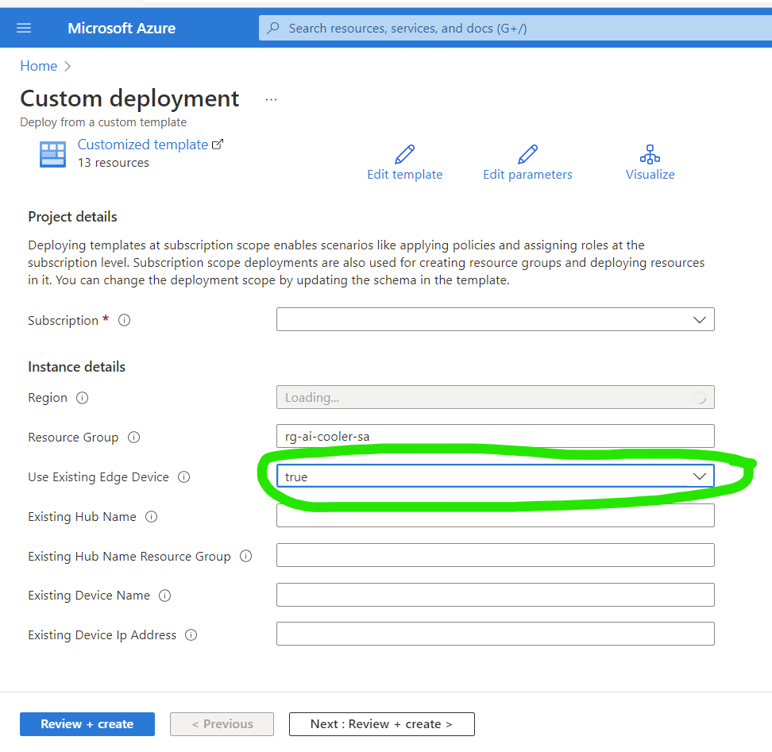

# Getting Started: Proof-of-Concept(POC) Solution

This section of the solution accelerator describes how to configure and deploy a POC solution that will enable an inventory management solution
similar to simulation.  

**REMINDER:** The physical solution described here was developed using locally available resources and is based on a unique retail scenario.
This solution will almost certainly require modifications before it can be deployed in a way that fits your business scenario. 

## Prerequisites 
1. Access to an Azure subscription, with required permissions
1. A basic understanding of [IoT and Edge Computing](https://azure.microsoft.com/en-us/services/iot-edge/#iotedge-overview)
1. An IoT Edge device and related beverage cooler hardware
1. Sufficient IoT skills to set up and configure an IoT edge device, including an [Arduino](https://www.arduino.cc/) module. 
1. Sufficient data engineering to configure and deploy an Azure Synapse instance with beverage inventory data
1. Sufficient web development skills to modify the web app showing inventory data contained in the data warehouse
1. Sufficient data science skills to modify the [Many Models Solution Accelerator](https://github.com/microsoft/solution-accelerator-many-models)
to work with beverage cooler data. 

## Configure POC Hardware and Applications
**Step 1.**  
Procure and install your IoT Edge Hardware, including edge device, cameras, and door sensor. 
- See the [Hardware Setup](hardware_setup.md) page for more information
- If you want to use the existing object detection model, create your own cans of Contoso Cola using these labels
    - [Contoso Original Cola](../documents/media/can_labels)
    - [Contoso Diet Cola](../documents/media/can_labels)

**Step 2.**  
Deploy resources to connect the IoT Edge devices to the Azure Synapse service

- Now, when you click "Deploy to Azure" you will set Use Existing Edge Device to **true** and provide all additional parameters. 
    - The Existing Device parameters (Hub Name, Resource Group, IP address) should be taken from the IoT Edge device configure in Step 1 

**Step 3.**  
Deploy the analytic portion of the solution 
- Visit the [Analytics Getting Started](../analytics/docs/getting_started_analytics.md) page to learn about deploying your data warehouse usint Azure Synapse and predictive models. 
You will need to complete some manual configuration to deploy these components in your environment. 
The two main sections of the analytics solution are:
    - Deploying resources
    - Configuring predictive models 

**Step 4.**
Deploy the sample web app and configure it to read from Azure Synapse
- The web app provides a dashboard that shows inventory metrics and actionable insights about future inventory levels. This step will also require some manual configuration to successfully deploy into your own environment. 
- Follow this link to learn more about configuring the [sample web app](./webAppPoc_README.md) for the POC solution. 
- REMINDER: The web app uses React for building UI components. Check here for information about creating a [React app](../frontend/cooler-app/README.md).

## Conclusion 

This completes the steps needed to deploy the POC solution. 

This is just an example of what could work for a beverage company. 
**-- Remember, your deployment will be different. --**
You will need to modify this POC work in your unique IT environment and meet your unique business needs. At the same time, this solution can be modified to deliver actionable insights for a wide variety business scenarios.
This accelerator can be used to guide solutions anywhere this is a need for remote objection detection, aggregation of this remote data into a data warehouse, and predicitive analytics to drive business improvements.
There are almost limitless possibilities!

