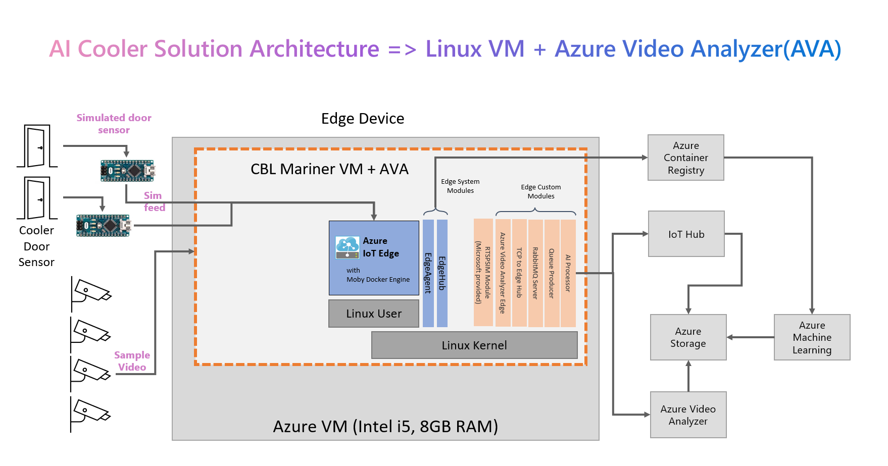
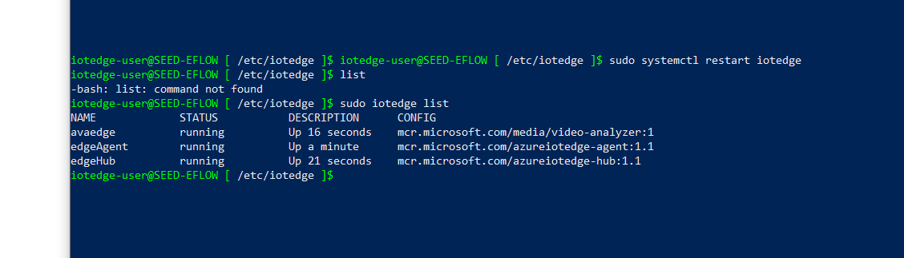

## Hardware Setup
This file describes how to setup and configure the hardware needed deploy a physical solution. This includes:
1. IoT Edge Device
1. Cameras
1. Door sensor 

## IoT Edge Architectural Overview
This is a diagram of the IoT Edge solution we will be building. 

### Azure IoT Edge for Linux on Windows (EFLOW)
[Azure IoT Edge for Linux on Windows (EFLOW)](https://docs.microsoft.com/en-us/windows/iot/iot-enterprise/azure-iot-edge-for-linux-on-windows) 
lets you run Azure IoT Edge in a Linux container on your Windows device. The Linux virtual machine comes pre-installed with the IoT Edge runtime.
Any IoT Edge modules deployed to the device run inside the virtual machine. 
Meanwhile, Windows applications running on the Windows host device can communicate with the modules running in the Linux virtual machine. 
Businesses that rely on Windows IoT to power their edge devices can now take advantage of the cloud-native analytics solutions being built in Linux.

## IoT Edge Device Configuration 

Any Mini-PC device capable of running Windows 10 should be sufficient for this POC. 

## Device Setup
1. Install Windows 10
1. Install Windows SDK 10.0.17763.132
1. Install VS Code
1. Install Azure IoT EFLOW
    - Visit the [Install IoT Edge](https://docs.microsoft.com/en-us/azure/iot-edge/how-to-provision-single-device-linux-on-windows-symmetric?view=iotedge-2020-11&tabs=azure-portal%2Cpowershell)
     section of this webpage for detailed instructions for installing and configuring EFLOW.
     - Use this command to check the status of your modules 

            sudo iotedge list

    -   You should see a message similar to this image. Note: You will not see avaedge module running until you install it in Step 8.

    
    
1. Install the VideoLAN VLC media player, to be used when validating camera setup
    - Visit this site to download [VideoLAN VLC](https://www.videolan.org/vlc/)
1. Install RTSP Streamer app and cameras 
    - Follow the [camera setup](../cameras/README.md) instructions to connect an RTSP stream to the EFLOW VM
    - Connect USB compatible  cameras to the device
    - Use the VLC app to confirm the cameras are working properly
    - Note: This app can be built on a different device and the build folder contents downloaded to the edge device 

1. Install door sensor
    - Follow the [door sensor setup](../doorSensor/README.md) instructions to connect the door sensor to the edge device. s to the correct pins on the general purpose bus
    - You can check that your Arduino module is working using the serial window. 

1. Install and configure the video module  

    
