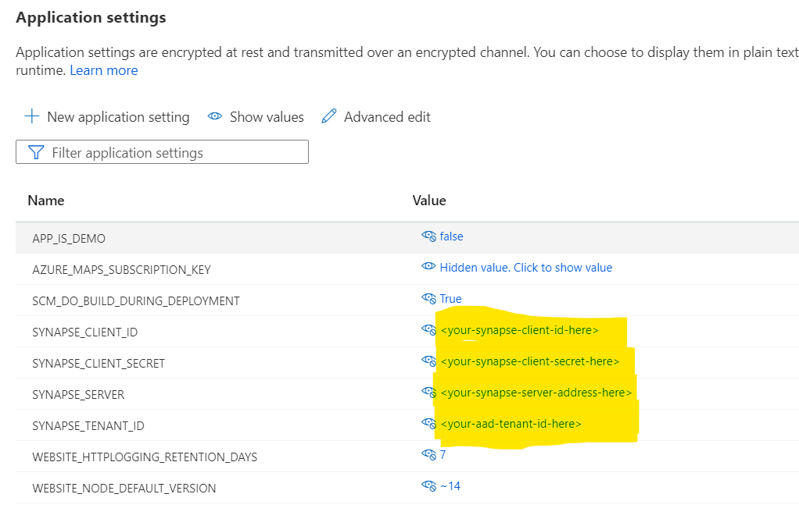
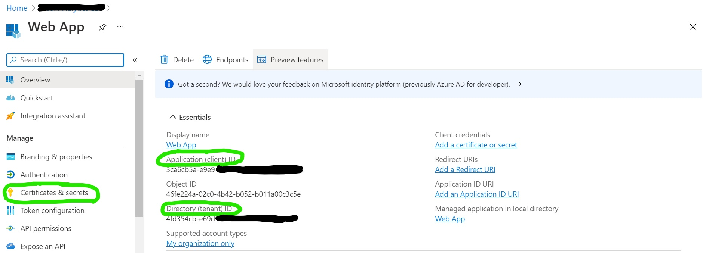
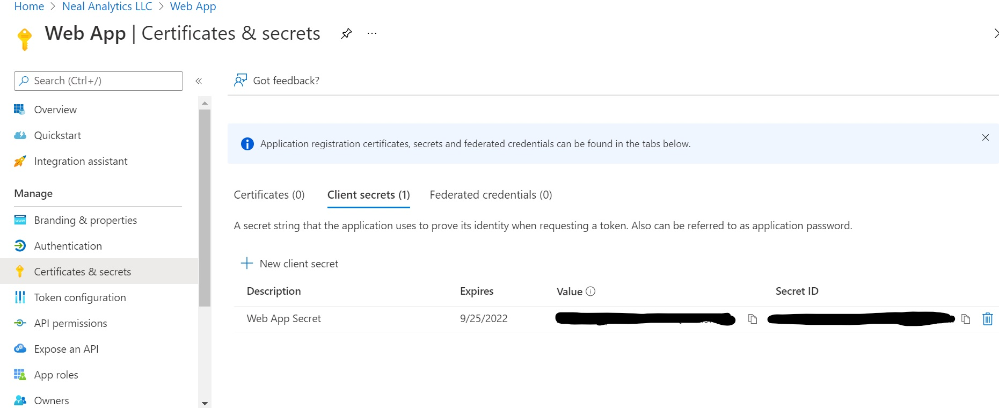

# Configuring the Web App to Display Cooler Inventory Information 

Once you have deployed your Azure Synapse data warehouse, are receiving regular updates from your edges devices, 
and making inventory projections models based on the Many Models solution, you are ready to show the results in the sample web application.

## Configuring the Web App

Follow these steps to create your Azure Active Directory (Azure AD) application and configure it to read from Azure Synapse. 
You will need to set the following environmental variables. 
- SYNAPSE_CLIENT_ID
- SYNAPSE_CLIENT_SECRET
- SYNAPSE_SERVER
- SYNAPSE_TENANT_ID

Step 1. After you deploy Azure Synapse configured, copy the endpoint of the serverless instance. 
- This value will be used for SYNAPSE_SERVER

Step 2. Create your [Azure AD application and service principal](https://docs.microsoft.com/en-us/azure/active-directory/develop/howto-create-service-principal-portal#get-tenant-and-app-id-values-for-signing-in). 
- Copy the Directory (tenant) ID, for use as the SYNAPSE_TENANT_ID
- Copy the Application (client) ID, for use as the SYNAPSE_CLIENT_ID

- Create the Service principal as a role, b/c the "role" needs to query Synapse 
- Use Option 2 to create a new application secret. This will be the value for SYNAPSE_CLIENT_SECRET

Step 3. Provide the app service principal access to Synapse
- Go to Synapse and give this newly created new app service principal Contributor access to the Blob storage
- This allows the web app to query data form the Synapse server (i.e. data warehouse)

Step 4. Restart the Front End web service 
- This will cause the Web App to apply the new environmental variables 
- Visit this page for information on how to launch the [web app](./findWebApp_README.md)

