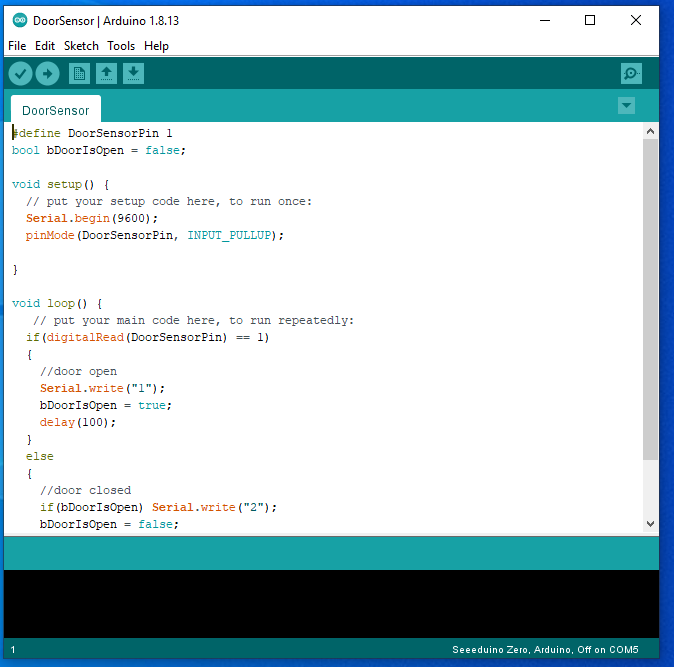
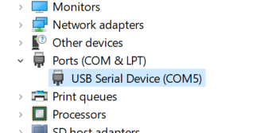

# Setup Door Sensor with Serial Passthrough

The following diagram shows the architecture we will bse using:

```

   Azure IoT Edge (EFLOW VM)                                                     Server (Windows)
      +--------------+
      |   Edge Hub   |  
      +--------------+                          
             |
             | Hub Routing  
+----------------------------+                                          +--------------------------+
|     TCP to Edge Hub        | .............. (network) ................|  Serial to TCP (hub4com) |
+----------------------------+                                          +--------------------------+
                                                                                  | Physical serial port
                                                                                  |
                                                                          +---------------+
                                                                          | Arduino Nano  |
                                                                          +---------------+
```

## Setup Host
- Ensure your Arduino module is properly setup on the edge device
    - Module and IDE are installed with current drivers
    - Arduino code is uploaded to the device
    - Door sensor is properly connected to the Arduino module
    - More information can be found on the [Arduino website](https://www.arduino.cc/)


- Here is an image of the Arduino IDE, including the code that is ready to be uploaded to the Arduino module  



- Download and extract hub4com-2.1.0.0-386.zip from [com0com project](https://sourceforge.net/projects/com0com/files/hub4com/2.1.0.0/) to a local directory, e.g. c:\hub4com
- Pick a TCP port number to associate to the serial port planned to expose.  In our example environment, we use port number 5002, and the port is associated with COM3.
    - You can find the COM port associated with the Arduino device by looking in Windows Device Manger -> COM Ports -> Ardunio device

    
 
    > **Note:** If you have a firewall enabled, explicitly configure the firewall rule to allow inbound traffic for TCP port 5002, or run the command in the next step and allow access when asked.
- Run hub4com in server mode, open a command prompt, type `cd /d c:\hub4com` and `com2tcp.bat \\.\COM3 5002` where **COM3** is the physical serial port name and **5002** is the TCP port number.  Click 'Allow access' if the Windows Defender Firewall dialog box pops up and asks for port access.
- Hub4Com starts in server mode waiting for a connection.
<br/>


## Setup Client 

**NOTE:** This section is not required for a working POC solution.

- Connect EFLOW VM via Windows Admin Center or PowerShell. Check the _doorSensor_ module is running using the `sudo iotedge list` command. To check the _doorSensor_ logs, use the commando `sudo iotedge logs doorSensor -f`.
<br/>

### Start the connection when system boot up
If necessary, you can further configure your host to enable the serial over network server when system boot up if necessary.

- Host: create a scheduled task to run hub4com.  The power shell script [scheduled-task-helper.ps1](./scheduled-task-helper.ps1) provides the following functions:
    1. `Add-StartupScheduledTask`: takes parameters TaskName, Execute and Argument to create a scheduled task that runs when system starts.
    2. `Remove-StartupScheduledTask`: task a parameter TaskName to unregister and delete the scheduled task with TaskName.

    To use the scripts,
    1. Save the scripts file to your PC.
    2. Open an elevated PowerShell window and change to the directory where you download the script.
    3. In the PowerShell window, import functions by dot sourcing the script.
    ```
    PS C:\Users\test> . .\scheduled-task-helper.ps1
    ```
    4. After importing the script, run the command Add-StartupScheduledTask with arguments
    ```
    PS C:\Users\test> Add-StartupScheduledTask -TaskName com2tcp -Execute 'C:\hub4com\com2tcp.bat' -Argument '\\.\COM3 5002'
    ```
    5. Check if the task created successfully and is running.  It might take a couple of seconds for task scheduler to start the task so you might see the task in Ready state.  Wait for a couple of seconds and re-run Get-ScheduledTask to get the latest task state.
    ```
    PS C:\Users\test> Get-ScheduledTask -TaskName com2tcp

    TaskPath                                       TaskName                          State
    --------                                       --------                          -----
    \                                              com2tcp                           Running
    ```
    
    6. Note: to clean up the scheduled task, run the Remove-StartupScheduledTask command.  You might need to reboot the system to ensure clean up the scheduled task
    ```
    PS C:\Users\test> Remove-StartupScheduledTask -TaskName com2tcp
    ```
